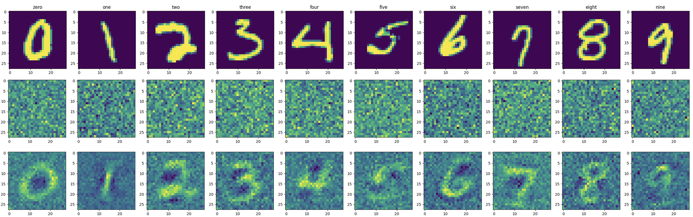
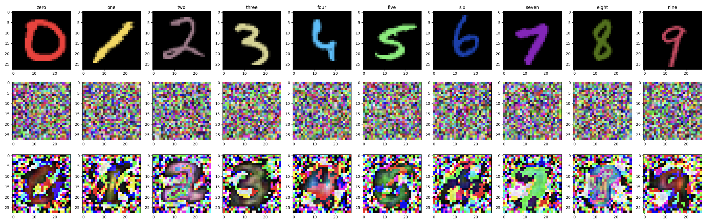

# FL-DP-KIP

## Dependendencies

    python 3.10.8
    absl-py 1.3.0  
    autodp 0.2
    cudatoolkit 11.3.1
    cudnn 8.2.1
    jax 0.4.1 
    jaxlib 0.4.1+cuda11.cudnn82
    matplotlib  3.6.2
    numpy  1.24.1
    scikit-learn 1.1.3 
    scipy 1.9.3 
    xgboost 1.7.3 
    tensorflow-datasets 4.8.1
    tensorflow 2.11.0
    seaborn 0.12.2
    pandas 1.5.3
    neural-tangents 0.6.1
    
  
## Run FL-DP-KIP

`python3 feddpkip_inf_ntk.py > ./output/Fed-DP-KIP.txt`

`python3 feddpkip_inf_ntk_imbalance.py > ./output/Fed-DP-KIP_imblance.txt`

* Colored MNIST from "Learning from Failure: Training Debiased Classifier from Biased Classifier" [link](https://github.com/alinlab/LfF)

`python3 feddpkip_inf_ntk_colored.py --dpsgd=True --epsilon=0.5 --width=100 --l2_norm_clip=1.0 --learning_rate=0.01 --batch_size=32 --reg=0.001 --epochs=10 --support_size=500 --result_images_path=result_images_0.5_500 > ./output_0.5_500/100_1.0_0.01_32_0.001_10.txt`

## Sample output images [WIP]

* Class Imbalanced

* Color-MNIST

